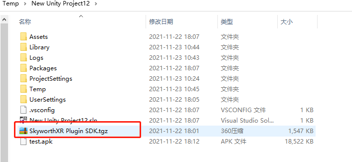

<!--
 * @Author: xieminghui
 * @Date: 2021-11-22 18:19:45
 * @Description: Description
 * @LastEditors: xieminghui
 * @LastEditTime: 2021-12-13 09:44:22
 * @Copyright: Copyright 2020 Skyworth VR. All rights reserved.
-->
Q&A
===
Q：How to place the SDK plugin to a relative path
---
A：Put `SkyworthXR Plugin SDK.tgz` into the project directory,
    
Modify the `Packages\manifest.json` file and add the `"com.unity.xr.skyworth": "file:../SkyworthXR Plugin SDK.tgz"` field.