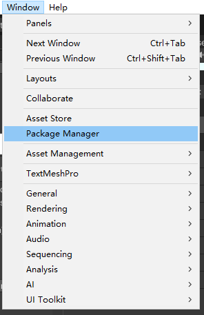
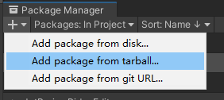
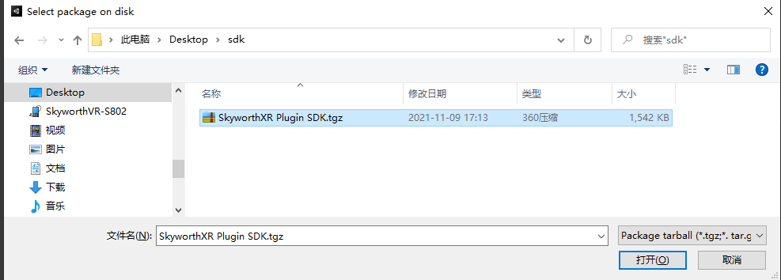
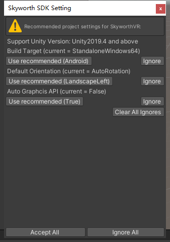
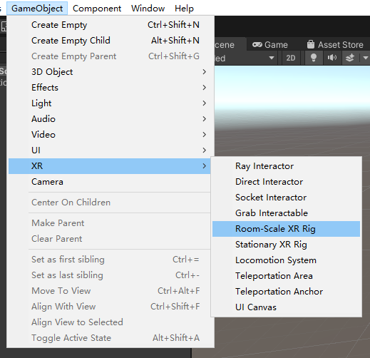
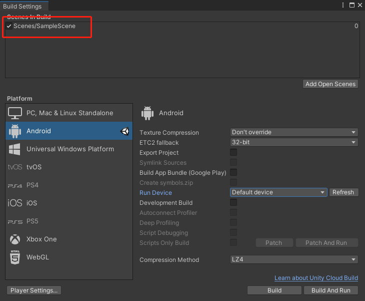
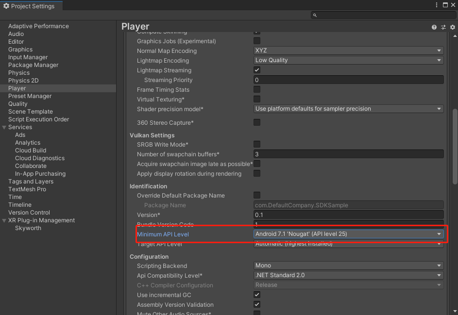
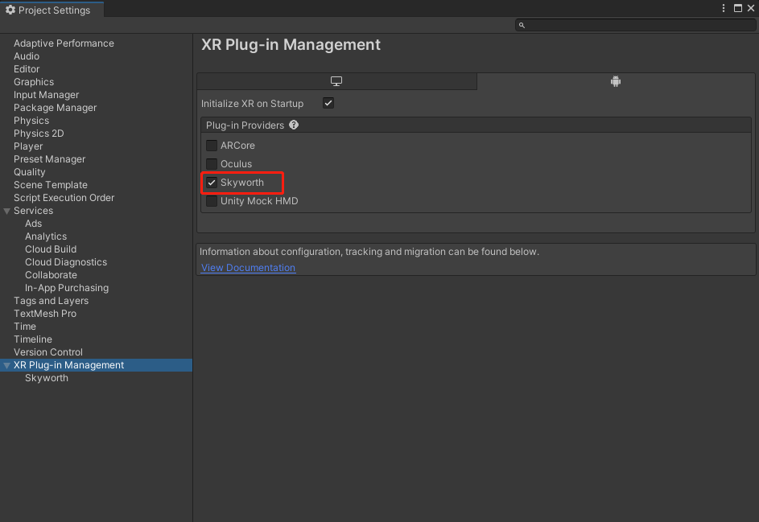
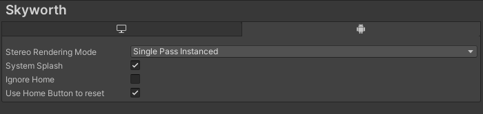
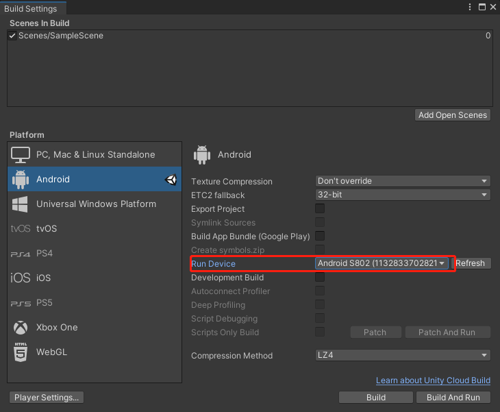

<!--
 * @Author: xieminghui
 * @Date: 2021-11-11 10:08:59
 * @Description: Description
 * @LastEditors: xieminghui
 * @LastEditTime: 2021-12-13 09:43:04
 * @Copyright: Copyright 2020 Skyworth VR. All rights reserved.
-->
Build the first APK
====
## 1.Create project
1. Open`Unity Hub`。
2. Go to the `Project` page and click the `New` button.
3. Select `3D`, set the project name and project location, and click `Create`.
## 2.Import Skyworth Plugin SDK
1. Open `Window`, and open `Package Manager` from the drop-down menu.

    

2. Click the `+` sign in the upper left corner to open the second `Add Package from tarbll...` in the drop-down menu.

    

3. Assign the tgz package to the SDK and click the Open button.

    

4. When the import is complete, a dialog box will pop up, click `Accept All`.

    

## 3.Production scene
1. Open the `SampleScene` scene in the `Scenes` folder.
2. Select `GameObject` in the menu bar, select `XR`, select `Room-Scale XR Rig`. An `XR Interaction Manager` and `XR Rig` will be created in the scene. Then save the scene.

    

## 4.Configuration settings
1. Select `File`, `Build Settings...`, and click `Add Open Scenes`.

    

2. Click on `Player Settings` in the lower left corner.
3. Select `Player`, set `Minimum API Level` in `Other Settings` to 25 or below, **do not set it to 26 or higher than 26**.

    

4. Select the bottom `XR Plug-in Management`, select the Android column, and check `Skyworth`.

    

    Select `Skyworth` below to see the following settings, here the default settings are used.

    

    **Stereo Rendering Mode：**
      - *Single Pass Instanced*，This is a single pass multivew mode, please refer to the official website for details(https://docs.unity3d.com/Manual/SinglePassStereoRendering.html)
      - *Multi Pass*，This is the multipass rendering mode

    **System Splash：**
      - Set true to use the splash screen that comes with the system.
      - Setting false will not use the system startup screen, you need to set it in Unity.

    **Ignore Home：**
      - Setting it to true will ignore the Home button, causing pressing the Home button will not exit the application.
      - After setting it to false, press the Home button to exit the application and return to the Launcher.

    **Use Home Button to reset：**
      - After setting it to true, long press the Home button to return to the front view.
      - After it is set to false, the viewing angle cannot be returned to the normal view by pressing and holding the Home button.

## 5.Pack and run
1. Select `Android S802` in `Run Device` in `Build Settings`.

    

2. Click`Build And Run`。
