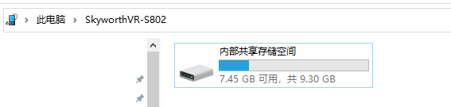

<!--
 * @Author: xieminghui
 * @Date: 2021-11-10 17:42:02
 * @Description: Description
 * @LastEditors: xieminghui
 * @LastEditTime: 2021-12-13 09:43:44
 * @Copyright: Copyright 2020 Skyworth VR. All rights reserved.
-->
Connect the device
====
## 1.Connect USB
To install the application on the device, you need to connect the device to the computer via a USB cable. When the device is connected to the computer, the computer will detect that the MTP device is connected, and the MTP device of `SkyworthVR` can be seen in the `this computer`. After double-clicking to open it is `Internal Shared Storage Space`.



## 2.Use ADB
the adb command is a tool provided in the Android SDK, which can be used to install apk, uninstall apk, debug and capture running logs, etc. The tool is located in the `/Android/SDK/platform-tools/` folder in your SDK installation directory. Then you need to add adb to the environment variables.

Execute commands in the console
```
adb devices
```
Output
```
List of devices attached
1132833702821042600064  device
```
For more adb command usage, please refer to [Android document](https://developer.android.com/studio/command-line/adb)。