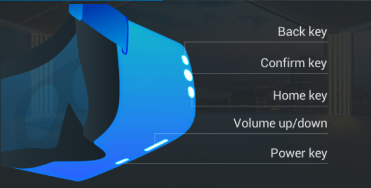
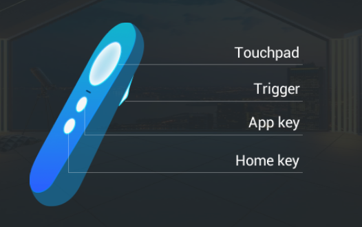

<!--
 * @Author: xieminghui
 * @Date: 2021-11-12 09:32:31
 * @Description: Description
 * @LastEditors: xieminghui
 * @LastEditTime: 2021-12-13 09:43:57
 * @Copyright: Copyright 2020 Skyworth VR. All rights reserved.
-->
Enter
===
## 1.Input mapping table
In the Unity plugin SDK, real physical buttons need to be mapped to virtual buttons. In the code, the virtual buttons are used to obtain the state of the buttons to determine whether the button is pressed or lifted.
### HMD



Mapping table:

|Physical buttons|Virtual buttons|
|--|--|
|Home Button|HomeButton|
|Confirm Key|PrimaryButton|
|Back button|MenuButton|
|Volume Up Button|VolumeUpButton|
|Volume Down Button|VolumeDownButton|

For example, an example of obtaining the Home key:
``` csharp
InputDevice HMDDevice = InputDevices.GetDeviceAtXRNode(XRNode.CenterEye);
if (HMDDevice.TryGetFeatureValue(new InputFeatureUsage<bool>("HomeButton"), out bool homevalue))
{
    HMD_HomeButton.SetActive(homevalue);
}
```

### Handle



Mapping table:

|Physical buttons|Virtual buttons|
|--|--|
|Touchpad buttons|PrimaryButton|
|APP key|MenuButton|
|Home Button|HomeButton|
|Trigger Button|TriggerButton|

For example, to get the event of a touchpad button:
``` csharp
InputDevice RightControllerDevice = InputDevices.GetDeviceAtXRNode(XRNode.RightHand);
if (RightControllerDevice.TryGetFeatureValue(new InputFeatureUsage<bool>("PrimaryButton"), out bool clickvalue))
{
    R_ClickButton.SetActive(clickvalue);
}
```
For more input related usage, please refer to [Input Sample](sample.md)