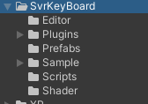
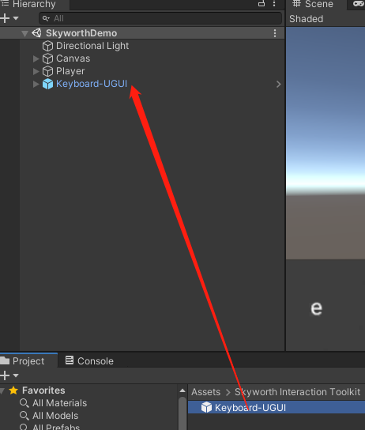
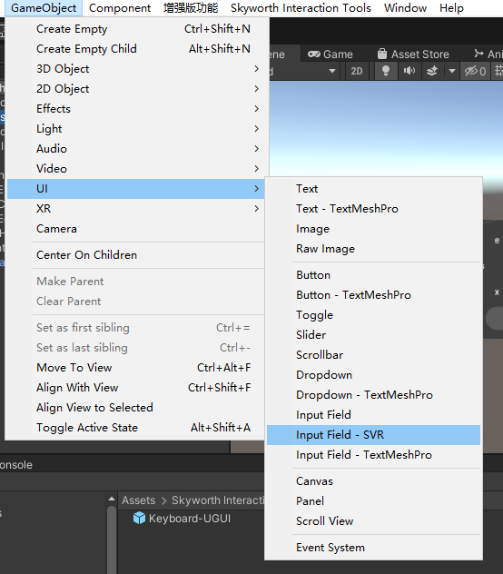
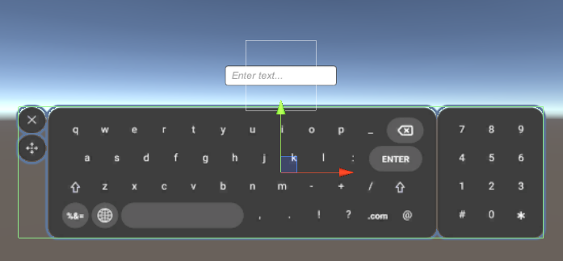

<!--
 * @Author: xieminghui
 * @Date: 2021-11-22 15:04:43
 * @Description: Description
 * @LastEditors: xieminghui
 * @LastEditTime: 2021-12-13 09:44:07
 * @Copyright: Copyright 2020 Skyworth VR. All rights reserved.
-->
Keyboard
===
## Introduction
The keyboard is located in the directory `Assets> Skyworth Interaction Toolkit> SvrKeyBoard`. Support multi-national language input.

>Note: Input in the editor is not supported, it can only be used on the device, please use the computer keyboard to input the editor.

## Start using
1. Find the catalog：`Skyworth Interaction Toolkit > SvrKeyBoard > Prefabs`。
2. Drag `Keyboard-UGUI` into the scene.
   
   
3. Select the Canvas in the scene and click `GameObject> UI> Input Fiedl-SVR`.

    

4. Adjust the size and position of the keyboard.

    

5. Click the `Play` button to run.

    At this time, hold down the Alt key to control the position of the anchor point, click the input box to display the keyboard, and click the blank area to close the keyboard.
6. Compile and run to the device.

    
