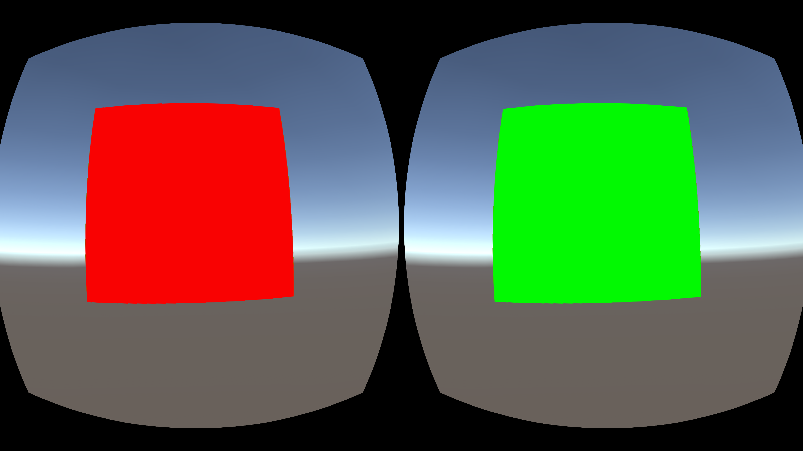

<!--
 * @Author: xieminghui
 * @Date: 2021-11-12 09:40:37
 * @Description: Description
 * @LastEditors: xieminghui
 * @LastEditTime: 2021-12-13 09:44:35
 * @Copyright: Copyright 2020 Skyworth VR. All rights reserved.
-->
How to realize the left and right split screen display
===
For example, the left and right eyes need to see different pictures respectively. For example, the left eye looks at red, and the right eye looks at green.


At this time, you need to make changes in the shader, using the **unity_StereoEyeIndex** variable.
``` c
v2f vert (appdata v)
{
    v2f o;
    o.vertex = UnityObjectToClipPos(v.vertex);
    o.uv = TRANSFORM_TEX(v.uv, _MainTex);
    o.uv.x *= 0.5;
    if (unity_StereoEyeIndex == 1)
        o.uv.x += 0.5;
    UNITY_TRANSFER_FOG(o,o.vertex);
    return o;
}
```
The effect seen in this way is



---
Code display
---
``` c
Shader "Unlit/StereoSampleShader"
{
    Properties
    {
        _MainTex ("Texture", 2D) = "white" {}
    }
    SubShader
    {
        Tags { "RenderType"="Opaque" }
        LOD 100

        Pass
        {
            CGPROGRAM
            #pragma vertex vert
            #pragma fragment frag
            // make fog work
            #pragma multi_compile_fog

            #include "UnityCG.cginc"

            struct appdata
            {
                float4 vertex : POSITION;
                float2 uv : TEXCOORD0;
            };

            struct v2f
            {
                float2 uv : TEXCOORD0;
                UNITY_FOG_COORDS(1)
                float4 vertex : SV_POSITION;
            };

            sampler2D _MainTex;
            float4 _MainTex_ST;

            v2f vert (appdata v)
            {
                v2f o;
                o.vertex = UnityObjectToClipPos(v.vertex);
                o.uv = TRANSFORM_TEX(v.uv, _MainTex);
                o.uv.x *= 0.5;
                if (unity_StereoEyeIndex == 1)
                    o.uv.x += 0.5;
                UNITY_TRANSFER_FOG(o,o.vertex);
                return o;
            }

            fixed4 frag (v2f i) : SV_Target
            {
                // sample the texture
                fixed4 col = tex2D(_MainTex, i.uv);
                // apply fog
                UNITY_APPLY_FOG(i.fogCoord, col);
                return col;
            }
            ENDCG
        }
    }
}

```