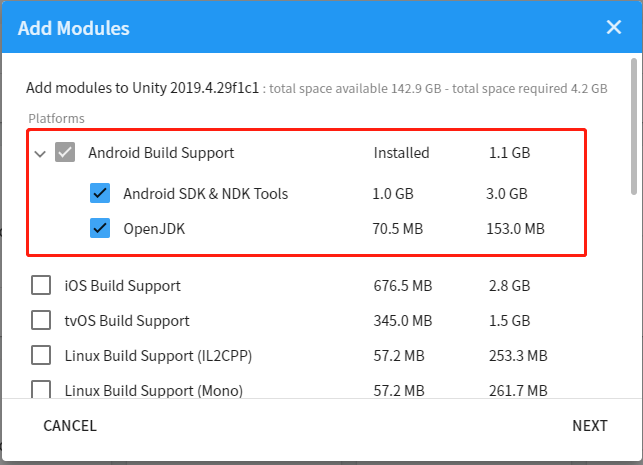

<!--
 * @Author: xieminghui
 * @Date: 2021-11-10 15:01:50
 * @Description: Description
 * @LastEditors: xieminghui
 * @LastEditTime: 2021-12-24 09:50:21
 * @Copyright: Copyright 2020 Skyworth VR. All rights reserved.
-->
Set up the development environment
===============
This chapter introduces how to set up the development environment to export applications that run normally on Skyworth all-in-one devices through Unity.
## 1.Necessary condition
**Supporting device：**
- V901
- S802
- 603

**Development system requirements**
- Windows 10(64 bit)

**Develop software**
- Unity Editor

## 2.Install Unity
Please go to Unity official website [download Unity](https://unity3d.com/get-unity/download/archive). The minimum Unity version we support is **2019.4 LTS**, and 2019.4.0 and above are recommended.
To compile Android applications, you also need to install the *Android Build Support* module, Android SDK, NDK and OpenJDK. Unity2019.x or higher versions can select the required Android tools during the installation process.

1.Go to [Download Unity](https://unity3d.com/get-unity/download/archive), click on `Unity Hub` and install.

2. Click on `Android Build Support`, select `Android SDK & NDK Tools` and `OpenJDK`. Then click on `INSTALL`

If you have installed Unity but not the Android module, you can still add the Android module in Unity Hub.

1. Open the Unity hub software, open the installation page, and find the installed Unity
2. There are three dots in the upper right corner of the installed Unity, click on “Add Module” after clicking them.
3. Then select `Android SDK & NDK Tools` and `OpenJDK`. Then click `Next`
4. On the `End User License Agreement` page, tick has been read and click the Finish button.

## 3.Create a new project
1. Open `Unity Hub`.
2. Go to the `Project` page and click the `New` button.
3. Select `3D`, set the project name and project location, and click `Create`.

If you already have a project, click `Add` to set the project path.
