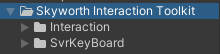
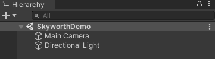
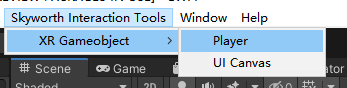
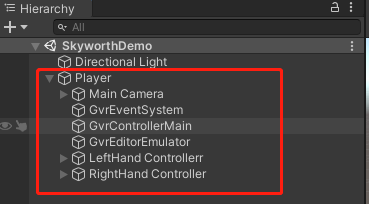
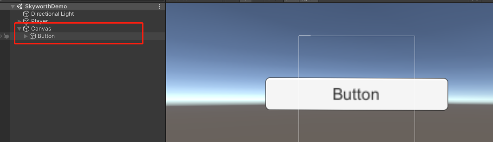
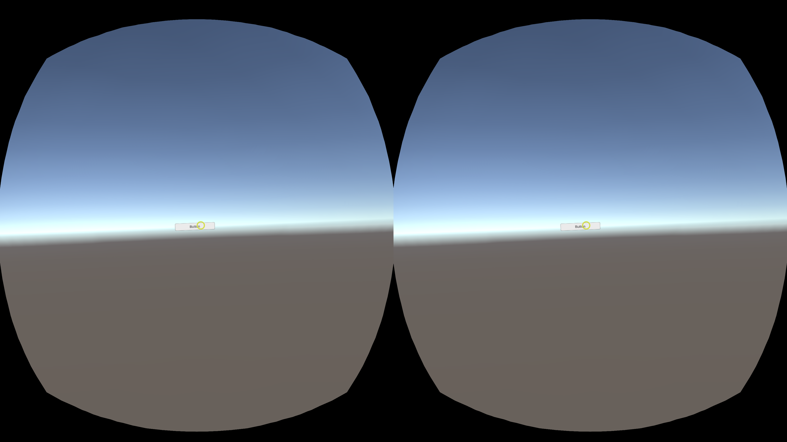
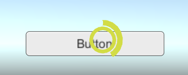
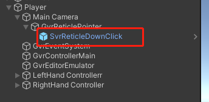
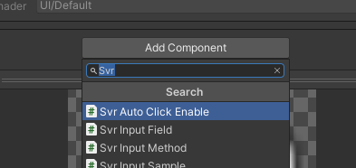

<!--
 * @Author: xieminghui
 * @Date: 2021-11-11 20:47:33
 * @Description: Description
 * @LastEditors: xieminghui
 * @LastEditTime: 2021-12-13 09:45:08
 * @Copyright: Copyright 2020 Skyworth VR. All rights reserved.
-->
Skyworth Interactive Tools
===
Why use Skyworth interactive tools? Skyworth interactive tools include the following functions:
- Handle model
- Anchor interaction
- Event system
- Can automatically switch between handle interaction or anchor point interaction
- [Anchor Point Countdown Click](#anchor-point-countdown-click)
- [Keyboard](keyboard.md)
## Quick start
Please follow the steps below to build your apk. First, please import Skyworth Plugin SDK, please refer to the document [Build the first APK](build_first_apk.md)

Steps：
1. Import Skyworth Intercation Toolkit.unitypackage to the project, and you will see the file in the picture after importing.

    

2. Create a new scene and name it SkyworthDemo.

   

3. Click Skyworth Interaction Tools/XR GameObject/Player in the menu bar. This will convert the Main Camera in the scene into a Player.

   
   

4. Click Skyworth Interaction Tools/XR GameObject/UI Canvas in the menu bar. This will create a Canvas in the scene, and then create a Button in this Canvas.

    

5. Add the SkyworthDemo scene to `Scenes In Build`, and then click `Build And Run`.

    

## Introduction of key components

|Component|Description|
|--|--|
|GvrControllerInput|Mainly used for device connection judgment and event forwarding|
|GvrReticlePointer|Head Control Anchor Point Components|
|GvrPointerInputModule|An important component of EventSystem, completes the triggering of UI events|
|GvrEditorEmulator|Hold down the Alt key to simulate head rotation in the editor|
|SvrTrackDevices|Key classes of different handle models|

## Anchor point countdown click
When the anchor point is hovered to the button, a countdown circle will be displayed on the anchor point, and a click event will be triggered when the countdown ends.

1. Find the **SvrReticleDownClick** prefab in the **Assets> SkyworthInteraction> Assets> Resources> Prefab** folder.
2. Drag the prefab into the **Player> Main Camera> GvrReticlePointer** node in the Hierarchy.

   

3. Click `Add Component` on the Button to be triggered, enter `Svr` in the input box, click **Svr Auto Click Enable**, and then a SvrAutoClickEnable script will be hung on this Button.

    

|SvrReticleDownClick|Introduction|
|--|--|
|OnelySvrAutoClickEnable| Tis used to determine whether to enable global event triggering, set to true can only be used on the component with the SvrAutoClickEnable script hanging, set to false can be used globally|
